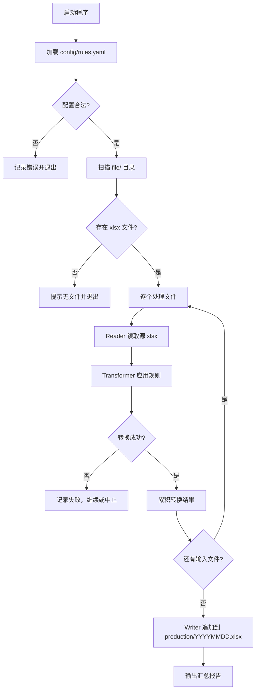
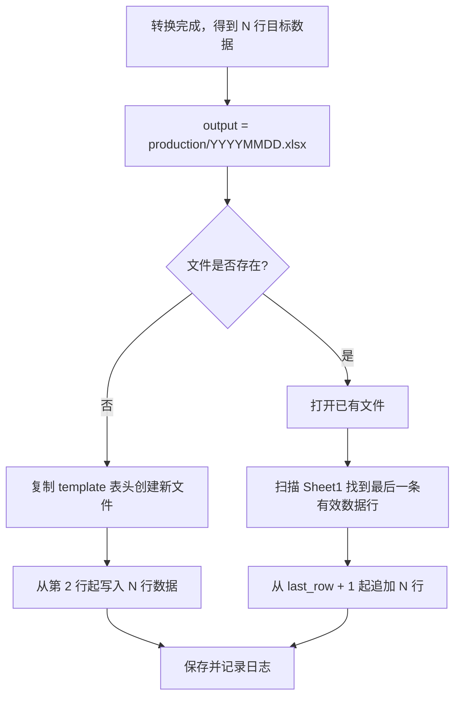
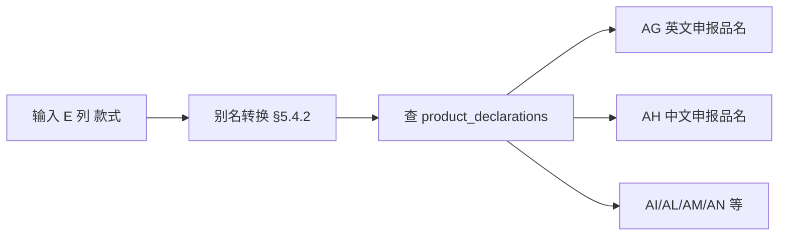
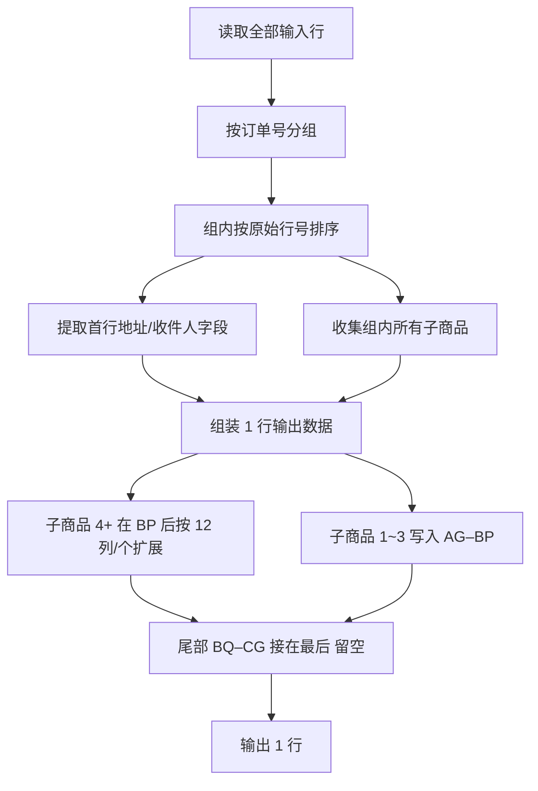
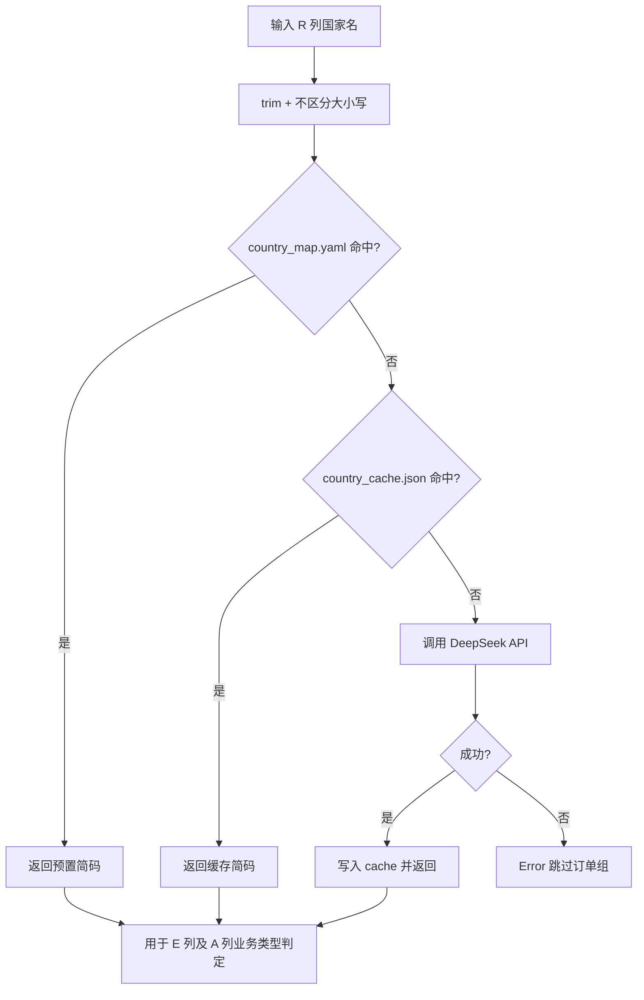

# Mindy — XLSX 数据处理设计文档

> 业务规则来源：`docs/业务类型.docx`（顺丰出口模板填写规范）。本文档为程序实现的完整技术设计。

## 目录

| 章 | 内容 |
|----|------|
| [1](#1-项目概述) | 项目概述 |
| [2](#2-目录结构) | 目录结构 |
| [3](#3-系统架构) | 系统架构 |
| [4](#4-处理流程) | 处理流程 |
| [5](#5-输入文件格式规范) | 输入文件格式 |
| [6](#6-输出文件格式规范) | 输出文件格式（含动态列扩展 §6.7） |
| [7](#7-数据映射关系) | 数据映射与配置 |
| [8](#8-转换规则引擎) | 转换规则引擎 |
| [9](#9-技术选型) | 技术选型 |
| [10–16](#10-接口设计) | 接口、日志、测试、计划 |

---

## 1. 项目概述

### 1.1 背景与目标

Mindy 是一个本地运行的 XLSX 数据处理工具。程序从 `file/` 目录读取订单源 Excel 文件（`.xlsx`），按预定义的转换规则将订单数据映射为**顺丰国际快递导入模板**格式，最终在 `production/` 目录生成以**当天日期**命名的 Excel 文件。

**业务场景**：将刺绣/定制类电商订单（如 `file/20260606.xlsx`）转换为顺丰快递批量导入模板（参考 `example/0604顺丰快递模板填写完成_豆包AI生成.xlsx`），供物流系统导入使用。

### 1.2 核心能力

| 能力 | 说明 |
|------|------|
| 批量读取 | 扫描 `file/` 下所有 `.xlsx` 文件（支持单文件或目录批量处理） |
| 规则转换 | 按配置文件或内置规则，将源数据映射到目标表结构；相同订单号多行合并为一行 |
| 文件输出 | 在 `production/` 下生成以当天日期命名的 `.xlsx` 文件（如 `20260607.xlsx`）；若文件已存在则追加写入 |
| 可追溯 | 记录处理日志，便于排查转换失败或数据异常 |

### 1.3 非目标（当前版本不做）

- 不提供 Web UI 或在线服务
- 不处理 `.xls`（旧版 Excel 二进制格式）
- 不直接修改 `file/` 中的源文件（只读）
- 不支持目录监听、定时任务或后台自动调度（仅命令行手动执行）

### 1.4 已确认运营约束

| 编号 | 约束 | 说明 |
|------|------|------|
| O-01 | 备注不输出 | 输入 **O 列「备注」**仅作业务参考，**不写入**输出 xlsx 任何列（M-08） |
| O-02 | B 列日期格式 | 用户订单号中的日期段固定为 **`MMDD`**，不改为 `YYYYMMDD`（M-12） |
| O-03 | 自动扩列 | 追加写入时若列数不足，**自动扩展表头与列宽**，无需人工确认（M-13） |
| O-04 | 触发方式 | 仅通过 **命令行手动执行**，不做定时/监听（M-14） |
| O-05 | 品类不混合 | 服装定制与宠物定制来自**不同平台**，同一订单号下**不会**同时出现服装与宠物商品（M-09 补充） |

---

## 2. 目录结构

```
Mindy/
├── file/                  # 输入：待处理的源 xlsx 文件（只读）
│   └── 20260606.xlsx      # 输入格式参考样例
├── production/            # 输出：按日期命名的顺丰模板 xlsx
│   └── 20260607.xlsx      # 示例：当天日期命名
├── example/               # 输出格式参考样例（只读，不参与处理）
│   └── 0604顺丰快递模板填写完成_豆包AI生成.xlsx
├── docs/                  # 文档
│   ├── 设计文档.md        # 本文件：完整技术设计
│   └── 业务类型.docx      # 业务规则来源（顺丰填写规范）
├── config/                # 转换规则与运行配置（待实现）
│   ├── rules.yaml         # 字段映射、申报品名表、默认值
│   ├── country_map.yaml   # 北美/欧洲主流国家预置简码表（优先于 DeepSeek）
│   ├── template.xlsx      # 输出表头模板（从 example 复制，仅保留表头行）
│   └── country_cache.json # DeepSeek 解析结果缓存（仅表外国家）
├── src/                   # 源代码（待实现）
│   ├── main.py            # 程序入口
│   ├── reader/            # 读取输入订单文件
│   ├── transformer/       # 订单 → 顺丰模板 转换
│   ├── writer/            # 按日期命名写入/追加
│   └── common/            # 日志、路径、日期、配置加载
├── logs/                  # 运行日志（待实现，可选）
└── README.md
```

**路径约定**

- 输入根目录：`<项目根>/file/`
- 输出根目录：`<项目根>/production/`
- 输出格式参考：`<项目根>/example/0604顺丰快递模板填写完成_豆包AI生成.xlsx`（只作结构参照，运行时只读）
- 输出文件名：`YYYYMMDD.xlsx`，取程序运行当天的本地日期（如 2026-06-07 → `20260607.xlsx`）
- `production/` 在写入前若不存在则自动创建
- **追加策略**：若 `production/YYYYMMDD.xlsx` 已存在，新转换的数据行写入该文件**已有内容之后**（不覆盖、不重复写表头）；若不存在，则基于模板创建新文件（含表头 + 数据行）

---

## 3. 系统架构

### 3.1 总体架构

采用 **管道式（Pipeline）** 架构，将处理流程拆为四个独立阶段，各阶段通过统一的数据结构传递中间结果。

```
┌─────────────┐    ┌──────────────┐    ┌────────────────┐    ┌─────────────┐
│  Config     │───▶│   Reader     │───▶│  Transformer   │───▶│   Writer    │
│  Loader     │    │  (读取 xlsx)  │    │  (规则转换)     │    │ (写入 xlsx)  │
└─────────────┘    └──────────────┘    └────────────────┘    └─────────────┘
       │                  │                     │                      │
       ▼                  ▼                     ▼                      ▼
  rules.yaml         file/*.xlsx          顺丰模板行数据           production/YYYYMMDD.xlsx
```

### 3.2 模块职责

| 模块 | 职责 |
|------|------|
| **Config Loader** | 加载 `config/rules.yaml`，校验规则合法性，提供运行时参数（输入/输出路径、日志级别等） |
| **Reader** | 枚举 `file/` 下的 xlsx 文件，按工作表读取单元格数据，解析表头与数据行 |
| **Transformer** | 根据规则执行字段映射、类型转换、行过滤、列重排、合并多表等操作 |
| **Writer** | 按日期写入/追加；支持动态扩展品名列与尾部列后移（§6.7） |
| **Logger** | 输出处理进度、警告与错误信息到控制台及 `logs/` 文件 |

### 3.3 核心数据结构（逻辑模型）

程序内部使用与 Excel 库无关的统一表模型，便于切换底层读写库：

```text
Workbook
  └── sheets: Sheet[]
        ├── name: string          # 工作表名称
        ├── headers: string[]     # 表头（第一行或规则指定行）
        └── rows: Row[]
              └── cells: Cell[]
                    ├── value     # 原始值或转换后的值
                    └── type      # string | number | date | boolean | empty
```

---

## 4. 处理流程

### 4.1 主流程



### 4.2 单文件处理步骤

1. **发现文件**：遍历 `file/`，过滤扩展名为 `.xlsx` 的文件（忽略 `~$` 临时文件）
2. **打开工作簿**：读取所有工作表，或仅读取规则中指定的工作表
3. **解析表头**：默认取第一行作为表头；规则可指定 `header_row` 与 `header_mapping`
4. **读取数据行**：从表头下一行开始，跳过空行（可配置）
5. **执行转换**：按规则对每行/每列进行处理（见第 5 节）
6. **确定输出文件**：计算当天日期，得到 `production/YYYYMMDD.xlsx`
7. **写入/追加**：文件不存在则基于模板新建；已存在则定位末行后追加数据（见 4.3）
8. **记录结果**：成功/失败、行数、耗时写入日志

### 4.3 输出文件追加逻辑



**追加规则细则**

| 项目 | 约定 |
|------|------|
| 判定「最后数据行」 | 从第 2 行向下扫描，以「用户订单号」（B 列）非空作为有效数据行标志；末行之后再写入 |
| 表头处理 | 追加模式下**不写表头**，仅写入数据行；新建模式下第 1 行为表头（与模板一致） |
| 同次运行多输入文件 | 多个 `file/*.xlsx` 转换后**合并追加**到同一个 `production/YYYYMMDD.xlsx` |
| 同日多次运行 | 每次运行均追加到当日文件末尾，实现当日批次累积 |
| 输入去重/合并 | 输入侧按「订单号」合并多行为一行输出；输出文件内不同订单号各占一行，不做额外去重 |

---

## 5. 输入文件格式规范

> 参考样例：`file/20260606.xlsx`

### 5.1 基本信息

| 属性 | 值 |
|------|-----|
| 工作表 | `Sheet1`（单表） |
| 表头行 | 第 1 行 |
| 数据起始行 | 第 2 行 |
| 列数 | 23 列（A–W） |
| 样例数据行数 | 20 行（第 2–21 行，其中存在同一订单号多行的情况） |

### 5.2 输入列定义

| 列 | 字段名 | 说明 | 样例 |
|----|--------|------|------|
| A | 订单号 | 电商订单唯一标识 | `4069189548` |
| B | 款式图 | 款式参考图 | （多为空或图片引用） |
| C | 顾客图 | 顾客上传图 | `Upload Your Photo: 1 file` |
| D | 编码 | 款式编码 | `090` |
| E | 款式 | 商品类型（**有限枚举**，见 §5.4） | `圆领衫`、`短袖`、`老爹帽` |
| F | 衣服颜色 | 颜色 | `黑色`、`深灰色` |
| G | 尺码 | 尺码 | `XL`、`XXL` |
| H | 数量 | 件数 | `1` |
| I | 绣线颜色 | 刺绣用线颜色 | （可空） |
| J | 袖口信息 | 袖口定制信息 | （可空） |
| K | 刺绣位置 | 刺绣位置（第 1 处） | （可空） |
| L | 胸口文本 | 胸口刺绣文字 | （可空） |
| M | 设计图 | 设计图引用 | （可空） |
| N | 刺绣位置 | 刺绣位置（第 2 处，列名重复） | （可空） |
| O | 备注 | 顾客定制说明（中英文混合） | 多行文本 |
| P | 店铺名称 | 店铺 | `唐唐` |
| Q | 收件人名称 | 收件人姓名 | `Pauline Bisson` |
| R | 收件人国家 | 国家全名 | `France`、`Canada`、`United States` |
| S | 联系方式 | 电话/手机 | 样例中多为空 |
| T | 城市 | 城市 | `Tournefeuille` |
| U | 州 | 省/州简称 | `ON`、`TX`（非美国/加拿大可能为空） |
| V | 邮编 | 邮政编码 | `31170` |
| W | 详细地址 | 街道地址 | `17B rue Michel Montagne, Appartement 7` |

### 5.3 输入数据特点（影响转换设计）

- **国家字段为全名**：输出模板要求 ISO 国家代码（如 `CA`、`FR`、`US`），需通过国家名映射表转换
- **联系方式常为空**：样例中 S 列无值时，M/N 列填 `6479375666`（M-03 已确认）
- **存在重复订单号**：同一订单号可出现多行（如 `4069983558` 出现 4 次），表示**同一收件地址下需邮寄多个产品**；输出时**合并为一行**（见 7.5 节）
- **款式为有限枚举**：E 列仅出现 `业务类型.docx` 申报品名表中的类型或其别名（§5.4），不会出现表外值
- **定制备注不输出**：O 列「备注」含中英文定制说明，**不映射到输出表**（M-08 已确认）

### 5.4 输入「款式」枚举（E 列）

输入文件 E 列「款式」为**有限集合**，全部定义于 `docs/业务类型.docx` 申报品名映射表。程序只接受下列值（含别名），其余值记录 **Error** 并跳过。

#### 5.4.1 标准款式（直接匹配）

| 分类 | 标准款式名 |
|------|------------|
| 服装类 | T恤、棒球帽、带帽卫衣、圆领衫 |
| 宠物类 | PU宠物项圈、PU宠物项圈（带钻）、宠物项圈（带钻） |

#### 5.4.2 输入别名（先转换再查表）

| 输入 E 列可能出现的值 | 转换为标准款式 |
|----------------------|----------------|
| 短袖 | T恤 |
| 老爹帽 | 棒球帽 |

#### 5.4.3 样例文件中的款式

`file/20260606.xlsx` 中出现的 E 列值：`圆领衫`、`短袖`、`老爹帽`——均可通过上表匹配。

#### 5.4.4 校验规则

```text
raw = 输入 E 列.strip()
standard = style_aliases.get(raw, raw)
if standard not in product_declarations:
    Error: 未知款式
```

---

## 6. 输出文件格式规范

> 参考样例：`example/0604顺丰快递模板填写完成_豆包AI生成.xlsx`

### 6.1 基本信息

| 属性 | 值 |
|------|-----|
| 模板类型 | 顺丰国际快递批量导入模板 |
| 工作表 | `Sheet1` |
| 表头行 | 第 1 行 |
| 数据起始行 | 第 2 行 |
| 列数 | 基础 85 列（A–CG，含 3 个品名槽位）；商品数 > 3 时动态扩展（§6.7） |
| 样例填充行数 | 27 行有效数据（B 列「用户订单号」非空） |

### 6.2 输出列定义（完整表头）

| 列 | 字段名 | 必填标记 |
|----|--------|----------|
| A | 业务类型*[0] | * |
| B | 用户订单号*[1] | * |
| C | 收件公司[13] | |
| D | 收件联系人*[14] | * |
| E | 目的地国家代码*[15] | * |
| F | 收方州/省[16] | |
| G | 收方城市*[17] | * |
| H | 收方县/区[18] | |
| I | 收方城市编码[19] | |
| J | 收方详细地址*[20] | * |
| K | 收件人门牌号[21] | |
| L | 收件邮编*[22] | * |
| M | 收件人电话*[23] | * |
| N | 收件人手机*[24] | * |
| O | 收件人邮箱[25] | |
| P | 订单所属品类[26] | |
| Q | 收件人身份证号/护照号[27] | |
| R | 税号[28] | |
| S | ABN/EORI/IOSS/VOEC/UID/PRC[29] | |
| T | GSTexemptionCode[30] | |
| U | 若不符合尺寸要求，滞留或者转寄非邮箱件渠道（滞留：0；转寄：1）[75] | |
| V | 总重量(KG)[31] | |
| W | 长（CM）[32] | |
| X | 宽（CM）[33] | |
| Y | 高（CM）[34] | |
| Z | 是否带电*[38] | * |
| AA | 申报价值币种* | * |
| AB | 成本价币种[77] | |
| AC | 成本总价[87] | |
| AD | 配货信息[39] | |
| AE | 商品网址链接[40] | |
| AF | 平台网址[41] | |
| AG | 英文申报品名1*[42] | * |
| AH | 中文申报品名1*[43] | * |
| AI | 申报价值（单价）1*[44] | * |
| AJ | 成本单价1[78] | |
| AK | 商品网址链接1[45] | |
| AL | 品名1单位重量*[46] | * |
| AM | 申报品数量1*[47] | * |
| AN | 海关货物编号1[49] | |
| AO–CG | （品名 2/3、预留字段、进口商、电商企业等扩展列） | 部分 * |

> 品名 2/3 组（AS–BP）及预留/进口商/电商字段（BQ–CG）结构与品名 1 类似，完整列名见样例文件第 1 行。

### 6.3 输出列填写规则（A–AF）

> 以下规则适用于合并后的每一行输出数据，与 `业务类型.docx` 第一节一致。A–AF 列已确认。

**重要**：A 列「业务类型」须与顺丰模板**下拉列表**选项完全一致（含字体），手动输入格式不一致会导致无法上传订单。

#### A 列 — 业务类型*[0]

仅两种取值，由**收件国家是否为美国**决定（判断依据：输入 R 列「收件人国家」转换前的原始值或转换后的国家代码为 `US`）：

| 条件 | 填写值 |
|------|--------|
| 订单地址为美国 | `服装专线` |
| 其他所有国家/地区 | `国际电商专递CD（普货）` |

```text
判定伪代码：
  if country_iso == "US":  # 美国
    A = "服装专线"
  else:
    A = "国际电商专递CD（普货）"
```

#### B 列 — 用户订单号*[1]

格式：`{前缀}-{日期}-{订单号}`

| 组成部分 | 说明 |
|----------|------|
| 前缀 | 服装定制 → `E`；宠物定制 → `C`（区分规则见 [6.5](#65-订单类型与-b-列前缀m-09)） |
| 日期 | 程序运行当天日期，格式 **`MMDD`**（如 6 月 6 日 → `0606`）；**不**使用 `YYYYMMDD`（M-12 已确认） |
| 订单号 | 输入 xlsx **A 列**「订单号」原始值 |

示例：

| 类型 | 输入订单号 | 运行日期 | 输出 B 列 |
|------|------------|----------|-----------|
| 服装定制 | `4069189548` | 2026-06-06 | `E-0606-4069189548` |
| 宠物定制 | `4069288666` | 2026-06-06 | `C-0606-4069288666` |

> 合并订单时，同一订单号的多行输入仍只输出一个 B 列值（前缀 + 日期 + 该订单号）。

#### C 列 — 收件公司[13]

**留空**，不填写任何内容。

#### D 列 — 收件联系人*[14]

填写收件人姓名，直接取输入 **Q 列**「收件人名称」。合并订单时取该订单首行 Q 列值。

#### E 列 — 目的地国家代码*[15]

填写 **ISO 3166-1 alpha-2** 两位国家简码（如英国 `GB`、加拿大 `CA`、法国 `FR`、美国 `US`）。

| 项目 | 说明 |
|------|------|
| 输入来源 | **R 列**「收件人国家」（国家全名，如 `United Kingdom`、`Canada`） |
| 转换优先级 | ① `config/country_map.yaml` 预置表 → ② `country_cache.json` → ③ **DeepSeek API** |
| 预置表范围 | 北美及欧洲主流国家/地区（§9.4.1）；**命中则不调用 DeepSeek** |
| 表外国家 | 调用 DeepSeek，结果写入 `country_cache.json` 供后续复用 |
| 全部失败 | 记录 **Error**，跳过该订单组 |

```text
输入 "Canada"         → country_map.yaml 命中 → CA（不调 DeepSeek）
输入 "France"         → country_map.yaml 命中 → FR
输入 "United States"  → country_map.yaml 命中 → US
输入 "Australia"      → 预置表未命中 → DeepSeek → AU → 写入 cache
```

#### F 列 — 收方州/省[16]

直接取输入 **U 列**「州」。省（州）为**必填项**；部分欧洲小国无省可不填，留空即可。

#### G 列 — 收方城市*[17]

直接取输入 **T 列**「城市」。城市为**必填项**。

#### H 列 — 收方县/区[18]

**留空**，不填写任何内容。

#### I 列 — 收方城市编码[19]

**留空**，不填写任何内容。

#### J 列 — 收方详细地址*[20]

直接取输入 **W 列**「详细地址」。合并订单时取该订单首行 W 列值。

#### K 列 — 收件人门牌号[21]

**留空**，不填写任何内容。

#### L 列 — 收件邮编*[22]

直接取输入 **V 列**「邮编」。

#### M 列 — 收件人电话*[23] / N 列 — 收件人手机*[24]

两列填写规则相同，均取决于输入 **S 列**「联系方式」：

| S 列状态 | M 列（电话） | N 列（手机） |
|----------|--------------|--------------|
| 不为空 | 写入 S 列数据 | 写入 S 列数据 |
| 为空 | 写入 `6479375666` | 写入 `6479375666` |

```text
contact = S列.strip()
phone = contact if contact else "6479375666"
M = phone
N = phone
```

> `file/20260606.xlsx` 样例中 S 列均为空，故 M、N 列均填 `6479375666`。

#### O–Y 列 — 收件人邮箱至包裹尺寸

**全部留空**，不填写任何内容。涉及字段如下：

| 列 | 字段名 |
|----|--------|
| O | 收件人邮箱[25] |
| P | 订单所属品类[26] |
| Q | 收件人身份证号/护照号[27] |
| R | 税号[28] |
| S | ABN/EORI/IOSS/VOEC/UID/PRC[29] |
| T | GSTexemptionCode[30] |
| U | 若不符合尺寸要求，滞留或者转寄非邮箱件渠道（滞留：0；转寄：1）[75] |
| V | 总重量(KG)[31] |
| W | 长（CM）[32] |
| X | 宽（CM）[33] |
| Y | 高（CM）[34] |

#### Z 列 — 是否带电*[38]

固定填写 **`否`**。

#### AA 列 — 申报价值币种*

固定填写 **`USD/美元`**（须与顺丰模板下拉选项格式一致）。

> `example/` 样例中写作 `USD/美国`，以 `业务类型.docx` 及模板下拉为准，实现时取 `USD/美元`。

#### AB–AF 列 — 成本价至平台网址

**全部不填**（留空）。涉及字段如下：

| 列 | 字段名 |
|----|--------|
| AB | 成本价币种[77] |
| AC | 成本总价[87] |
| AD | 配货信息[39] |
| AE | 商品网址链接[40] |
| AF | 平台网址[41] |

> AD「配货信息」已确认为留空；合并订单时第 4 个及以上子商品的溢出处理改在 **AG 列及以后**规则中讨论。

#### A–AF 列规则汇总

| 输出列 | 字段名 | 输入来源 | 填写规则 | 状态 |
|--------|--------|----------|----------|------|
| A | 业务类型*[0] | R 列（间接） | 美国 → `服装专线`；其他 → `国际电商专递CD（普货）` | ✅ |
| B | 用户订单号*[1] | A 列 + 日期 + 类型 | `E/C-MMDD-{订单号}` | ✅ |
| C | 收件公司[13] | — | 留空 | ✅ |
| D | 收件联系人*[14] | Q 列 | 人名 | ✅ |
| E | 目的地国家代码*[15] | R 列 | 预置表优先 → DeepSeek 兜底 | ✅ |
| F | 收方州/省[16] | U 列 | 直接映射 | ✅ |
| G | 收方城市*[17] | T 列 | 直接映射 | ✅ |
| H | 收方县/区[18] | — | 留空 | ✅ |
| I | 收方城市编码[19] | — | 留空 | ✅ |
| J | 收方详细地址*[20] | W 列 | 直接映射 | ✅ |
| K | 收件人门牌号[21] | — | 留空 | ✅ |
| L | 收件邮编*[22] | V 列 | 直接映射 | ✅ |
| M | 收件人电话*[23] | S 列 | S 非空 → S；否则 `6479375666` | ✅ |
| N | 收件人手机*[24] | S 列 | 同 M 列 | ✅ |
| O–Y | 邮箱～高（CM） | — | 留空 | ✅ |
| Z | 是否带电*[38] | — | 固定 `否` | ✅ |
| AA | 申报价值币种* | — | 固定 `USD/美元` | ✅ |
| AB–AF | 成本价～平台网址 | — | 留空 | ✅ |
| AG–BP+扩展 | 品名 1～N 列组 | 输入 E 列「款式」 | §6.6 + §6.7 动态扩展 | ✅ |

### 6.5 订单类型与 B 列前缀（M-09）

来源：`业务类型.docx` 第二节。

| 订单类型 | B 列前缀 | 识别依据（输入「款式」） |
|----------|----------|--------------------------|
| 服装定制 | `E` | T恤、棒球帽、带帽卫衣、圆领衫及别名（见 §6.6） |
| 宠物定制 | `C` | PU宠物项圈、PU宠物项圈（带钻）、宠物项圈（带钻） |

**业务前提**（O-05）：服装定制与宠物定制分属不同平台，**同一订单内子商品品类一致**，不会出现服装与宠物混单。

**前缀判定规则**（合并订单时）：

1. 取组内任一子商品（通常与首子商品相同）的「款式」查映射表 → 服装类前缀 `E`，宠物类前缀 `C`
2. 若出现服装+宠物混单（异常数据），记录 **Error**，跳过该订单组
3. 款式无法匹配映射表及别名时，记录 **Error**，跳过该订单组

### 6.6 品名列组填写规则（AG–AR / AS–BD / BE–BP）

来源：`业务类型.docx` 第三节。**核心流程**：读取输入 **E 列「款式」** → 经 §5.4 别名转换为标准款式 → 查申报品名映射表 → 写入输出品名列组。



#### 6.6.1 款式 → 申报品名转换（AG / AH）

| 步骤 | 说明 |
|------|------|
| 1 | 取子商品对应输入行的 **E 列「款式」** |
| 2 | 经 `style_aliases` 转为标准款式（见 §5.4） |
| 3 | 在 `product_declarations` 中查该行数据 |
| 4 | **AG** ← 映射表 `en`（英文申报品名） |
| 5 | **AH** ← 映射表 `cn`（中文申报品名） |

多商品订单中，第 2、3 个子商品写入 **AS–BD**、**BE–BP**；第 4 个起见 §6.7。

#### 6.6.2 品名 1 列组逐列规则（AG–AR）

以下规则适用于**品名 1**；品名 2、品名 3 按列名类推（见 §6.6.4）。

| 输出列 | 字段名 | 填写规则 | 状态 |
|--------|--------|----------|------|
| AG | 英文申报品名1*[42] | 映射表 `en`（由输入 E 列款式转换） | ✅ |
| AH | 中文申报品名1*[43] | 映射表 `cn`（由输入 E 列款式转换） | ✅ |
| AI | 申报价值（单价）1*[44] | 映射表 `unit_price`（均为 `1.01`） | ✅ |
| AJ | 成本单价1[78] | **留空** | ✅ |
| AK | 商品网址链接1[45] | **留空** | ✅ |
| AL | 品名1单位重量*[46] | 映射表 `unit_weight`（随商品类型变化） | ✅ |
| AM | 申报品数量1*[47] | 映射表 `quantity`（均为 `1`） | ✅ |
| AN | 海关货物编号1[49] | 映射表 `hs_code`（随商品类型变化） | ✅ |
| AO | 法定数量1[91] | **留空** | ✅ |
| AP | 第二数量1[92] | **留空** | ✅ |
| AQ | 法定计量单位1[93] | **留空** | ✅ |
| AR | 第二计量单位1[94] | **留空** | ✅ |

> **AL / AM / AN** 仅由商品类型（标准款式）决定，不读取输入「衣服颜色」「编码」等列。

#### 6.6.3 申报品名映射表（`业务类型.docx`）

| 标准款式 | AG 英文 | AH 中文 | AI 单价 | AL 重量 | AM 数量 | AN 海关编号 |
|----------|---------|---------|---------|---------|---------|-------------|
| T恤 | Man-made fiber knitted T-shirt | 混纺T恤 | 1.01 | 0.25 | 1 | 6109909050 |
| 棒球帽 | Hats and other headgear | 针织或梭织纺织材料制帽类 | 1.01 | 0.15 | 1 | 6505009900 |
| 带帽卫衣 | hoodie | 其他棉制针织套头衫 | 1.01 | 0.50 | 1 | 6110200090 |
| 圆领衫 | Crewneck Sweatshirt | 其他化纤制针织套头衫 | 1.01 | 0.25 | 1 | 6110300090 |
| PU宠物项圈 | Pet Collars made of PU leather with metal fittings | 人造革制宠物项圈（带金属扣件） | 1.01 | 0.15 | 1 | 4201000090 |
| PU宠物项圈（带钻） | Pet Collar with Rhinestones (PU) | PU革镶钻字母宠物项圈 | 1.01 | 0.15 | 1 | 4205009020 |
| 宠物项圈（带钻） | Pet Collar(Metal with Rhinestones) | 宠物项圈（金属镶钻款) | 1.01 | 0.15 | 1 | 71171900 |

#### 6.6.4 品名槽位分配（子商品 1～3）

合并订单的前 3 个子商品写入模板固定列；**AJ/AK、法定/第二数量及单位列均留空**。

| 子商品序号 | 列组 | 表头品名序号 |
|------------|------|--------------|
| 第 1 个 | AG–AR | 1 |
| 第 2 个 | AS–BD | 2 |
| 第 3 个 | BE–BP | 3 |

写入规则与 §6.6.2 相同。第 4 个及以上子商品见 §6.7 动态扩展。

#### 6.6.5 输出列填写状态汇总（固定段）

| 输出列范围 | 状态 | 说明 |
|------------|------|------|
| A–AF | ✅ | §6.3 |
| AG–AR（品名 1） | ✅ | §6.6.2 |
| AS–BD（品名 2） | ✅ | 规则同品名 1 |
| BE–BP（品名 3） | ✅ | 规则同品名 1 |
| BP 之后扩展段 | ✅ | 品名 4+，§6.7 |
| 尾部 BQ–CG 段 | ✅ | 整体后移，**数据留空**，§6.7.3 |

### 6.7 超 3 商品动态列扩展（M-11）

当单个订单的子商品数量 **超过 3 个** 时，在 **BP 列之后**按每个额外商品 **追加 12 列**，列名与 AG–AR 模式一致，仅将品名序号改为 `4`、`5`、`6`…；**不写方括号及括号内编号**（如 `[42]`）。全部子商品写完后，原模板 **BQ–CG 尾部列整体后移**，且**数据留空**。

#### 6.7.1 扩展原则

| 项目 | 规则 |
|------|------|
| 每商品列数 | **12 列**（与 AG–AR 一一对应） |
| 插入位置 | 紧接 BP 列之后；品名 4 占 12 列，品名 5 再占 12 列，以此类推 |
| 表头序号 | 第 N 个商品（N≥4）的 12 列表头，将模板中 `1` 替换为 `N` |
| 数据规则 | 与 §6.6.2 完全相同（AG/AH/AI/AL/AM/AN 有值；AJ/AK/AO–AR 留空） |
| 尾部列 | 原 BQ–CG 共 17 列，移至**最后一个品名槽位之后**，17 列**全部留空** |
| 商品数量不限 | 有多少子商品就扩展多少个槽位，直至写完 |

#### 6.7.2 扩展列表头命名（品名序号 = N）

以品名 1（AG–AR）为模板，生成品名 N 的 12 个表头（**去掉 `*` 及 `[数字]`**）：

| 序 | 品名 1 原表头（模板） | 品名 N 扩展表头（N≥4） |
|----|----------------------|------------------------|
| 1 | 英文申报品名1*[42] | 英文申报品名{N} |
| 2 | 中文申报品名1*[43] | 中文申报品名{N} |
| 3 | 申报价值（单价）1*[44] | 申报价值（单价）{N} |
| 4 | 成本单价1[78] | 成本单价{N} |
| 5 | 商品网址链接1[45] | 商品网址链接{N} |
| 6 | 品名1单位重量*[46] | 品名{N}单位重量 |
| 7 | 申报品数量1*[47] | 申报品数量{N} |
| 8 | 海关货物编号1[49] | 海关货物编号{N} |
| 9 | 法定数量1[91] | 法定数量{N} |
| 10 | 第二数量1[92] | 第二数量{N} |
| 11 | 法定计量单位1[93] | 法定计量单位{N} |
| 12 | 第二计量单位1[94] | 第二计量单位{N} |

```text
# 伪代码：生成品名 N 的 12 个表头名
headers(N) = [
  f"英文申报品名{N}", f"中文申报品名{N}", f"申报价值（单价）{N}",
  f"成本单价{N}", f"商品网址链接{N}", f"品名{N}单位重量",
  f"申报品数量{N}", f"海关货物编号{N}", f"法定数量{N}",
  f"第二数量{N}", f"法定计量单位{N}", f"第二计量单位{N}"
]
```

#### 6.7.3 尾部列（原 BQ–CG）后移规则

固定模板中 BQ–CG 位于品名 3（BE–BP）之后。动态扩展时，这 **17 列**整体平移到「最后一个品名槽位」之后，表头名称保持不变（可去掉方括号内编号，与扩展列风格一致），**数据列一律留空**：

| 尾部列（按顺序） | 数据 |
|------------------|------|
| 预留字段1、预留字段2、包裹保价金额（CNY)、预留字段4、预留字段5 | 空 |
| 生产销售单位名称、统一社会信用代码、电商平台名称 | 空 |
| 进口商公司名称、进口商联系人、进口商电话、进口商地址、进口商邮编、进口商法人番号 | 空 |
| 电商企业代码、电商企业名称、电商平台编码 | 空 |

#### 6.7.4 列布局与总列数

```text
列布局 =
  [A–AF 固定段]
  + [品名 1：AG–AR，12 列]
  + [品名 2：AS–BD，12 列]
  + [品名 3：BE–BP，12 列]
  + [品名 4…K：每槽 12 列，K = 子商品总数]
  + [尾部 BQ–CG 段，17 列，留空]

extra_slots = max(0, 子商品数 - 3)
总列数 = 85 + extra_slots × 12
```

| 子商品数 | 扩展槽位数 | 总列数 | 说明 |
|----------|------------|--------|------|
| 1～3 | 0 | 85 | 与 `example/` 模板列数一致 |
| 4 | 1（品名 4） | 97 | 如订单 `4069983558` |
| 5 | 2（品名 4、5） | 109 | — |
| K | K−3 | 85 + (K−3)×12 | 依此类推 |

#### 6.7.5 样例：订单 `4069983558`（4 个子商品）

| 子商品 | 款式 | 槽位 | 列位置 |
|--------|------|------|--------|
| 1 | 圆领衫 | 品名 1 | AG–AR |
| 2 | 短袖→T恤 | 品名 2 | AS–BD |
| 3 | 短袖→T恤 | 品名 3 | BE–BP |
| 4 | 短袖→T恤 | 品名 4 | BP 后新增 12 列（表头序号 4） |
| — | 尾部 | BQ–CG | 接在品名 4 之后，17 列留空 |

#### 6.7.6 文件级列宽与追加写入

| 场景 | 处理 |
|------|------|
| 单次运行 | 以本次所有订单的 **最大子商品数** 决定输出文件总列数 |
| 追加写入 | 若新批次所需列数 > 已有文件列数，**自动扩展表头**（插入品名列 + 后移尾部列），同步扩展现有数据行；**无需人工确认**（O-03） |
| 行内商品较少 | 多余品名槽位留空，不影响其他列 |


---

## 7. 数据映射关系

> 填写规则见第 6 节；本节为映射总表与 `config/rules.yaml` 配置结构。

### 7.1 已确认映射（A–尾部段）

| 输出列 | 输出字段 | 输入列 | 输入字段 | 转换说明 |
|--------|----------|--------|----------|----------|
| A | 业务类型*[0] | R | 收件人国家 | 美国（`US`）→ `服装专线`；其他 → `国际电商专递CD（普货）` |
| B | 用户订单号*[1] | A | 订单号 | `E/C-MMDD-{订单号}`，前缀见 §6.5 |
| C | 收件公司[13] | — | — | 留空 |
| D | 收件联系人*[14] | Q | 收件人名称 | 直接映射 |
| E | 目的地国家代码*[15] | R | 收件人国家 | `country_map.yaml` 优先；未命中则 DeepSeek |
| F | 收方州/省[16] | U | 州 | 直接映射，必填（欧洲小国可空） |
| G | 收方城市*[17] | T | 城市 | 直接映射，必填 |
| H | 收方县/区[18] | — | — | 留空 |
| I | 收方城市编码[19] | — | — | 留空 |
| J | 收方详细地址*[20] | W | 详细地址 | 直接映射 |
| K | 收件人门牌号[21] | — | — | 留空 |
| L | 收件邮编*[22] | V | 邮编 | 直接映射 |
| M | 收件人电话*[23] | S | 联系方式 | S 非空 → S；否则 `6479375666` |
| N | 收件人手机*[24] | S | 联系方式 | 同 M 列 |
| O–Y | 邮箱～高（CM） | — | — | 留空 |
| Z | 是否带电*[38] | — | — | 固定 `否` |
| AA | 申报价值币种* | — | — | 固定 `USD/美元` |
| AB–AF | 成本价～平台网址 | — | — | 留空 |
| AG/AS/BE | 英文申报品名 N | E | 款式 | E→别名→映射表 `en` |
| AH/AT/BF | 中文申报品名 N | E | 款式 | E→别名→映射表 `cn` |
| AI/AU/BG | 申报价值（单价）N | — | — | 映射表 `unit_price` |
| AJ/AV/BH | 成本单价 N | — | — | **留空** |
| AK/AW/BI | 商品网址链接 N | — | — | **留空** |
| AL/AX/BJ | 品名 N 单位重量 | — | — | 映射表 `unit_weight` |
| AM/AY/BK | 申报品数量 N | — | — | 映射表 `quantity` |
| AN/AZ/BL | 海关货物编号 N | — | — | 映射表 `hs_code` |
| AO–AR 等 | 法定/第二数量及单位 N | — | — | **留空** |

### 7.2 尾部列与待定映射

| 输出段 | 转换说明 | 状态 |
|--------|----------|------|
| 尾部 BQ–CG（后移段） | 17 列**全部留空**；位置随品名槽位数后移（§6.7.3） | ✅ |
| 备注 (O) | — | **不写入输出**（M-08） |
| 编码 (D) | 不参与品名匹配，仅 E 列「款式」驱动申报品名 | — |
| 数量 (H) | 不写入 AM（AM 由映射表 quantity 决定） | — |

### 7.3 规则项状态

| 编号 | 议题 | 状态 |
|------|------|------|
| M-01 | 用户订单号格式 | ✅ **已确认**：`E/C-MMDD-{订单号}` |
| M-02 | 重复订单号处理 | ✅ **已确认**：按订单号合并为一行 |
| M-03 | 联系方式为空 | ✅ **已确认**：S 为空时 M、N 均填 `6479375666` |
| M-04 | 申报品名来源 | ✅ **已确认**：按输入「款式」查 §6.6 映射表 |
| M-05 | 申报价值、重量、数量、海关编号 | ✅ **已确认**：均取自映射表；AJ/AK、法定计量列留空 |
| M-10 | 输入款式枚举校验 | ✅ **已确认**：仅允许 §5.4 所列标准款及别名 |
| M-11 | 超 3 商品动态列扩展 | ✅ **已确认**：BP 后每商品 +12 列；尾部 BQ–CG 后移留空 |
| M-06 | 业务类型 | ✅ **已确认**：按美国/非美国二分（见 6.3 A 列） |
| M-07 | 国家名 → 简码 | ✅ **已确认**：预置表优先（§9.4.1），表外才调 DeepSeek |
| M-08 | 定制备注是否写入 | ✅ **已确认**：O 列备注**不写入**输出表 |
| M-09 | 服装/宠物定制区分 | ✅ **已确认**：按 §6.5 款式决定 `E`/`C`；分平台不混单（O-05） |
| M-12 | B 列日期格式 | ✅ **已确认**：保持 `MMDD` |
| M-13 | 追加自动扩列 | ✅ **已确认**：自动扩列，无需人工确认 |
| M-14 | 触发方式 | ✅ **已确认**：命令行手动执行 |

### 7.4 映射配置格式（`config/rules.yaml`）

```yaml
global:
  input_dir: file
  output_dir: production
  output_filename: "{date}.xlsx"       # date = YYYYMMDD
  template: config/template.xlsx
  sheet: Sheet1
  order_date_format: "MMDD"            # B 列日期；固定 MMDD，不用 YYYYMMDD（M-12）
  auto_expand_columns: true            # 追加时自动扩列，无需确认（M-13）
  trigger: cli_manual                    # 仅命令行手动执行（M-14）

# 输入字段排除（M-08）
input_excluded_from_output:
  - 备注                                # O 列，不写入输出任何列

# A 列：业务类型（已确认）
business_type:
  us_value: "服装专线"
  default_value: "国际电商专递CD（普货）"
  us_country_codes: ["US"]

# B 列：用户订单号前缀（M-09 已确认）
order_id_format:
  clothing_prefix: "E"
  pet_prefix: "C"
  pattern: "{prefix}-{date}-{order_no}"
  prefix_by: first_sub_product_style     # 以合并后首子商品款式判定

# E 列：国家简码转换（M-07）
country_resolver:
  preset_map_file: config/country_map.yaml   # 优先；北美+欧洲主流国家
  cache_file: config/country_cache.json      # DeepSeek 结果缓存（表外国家）
  provider: deepseek                         # 仅预置表+缓存均未命中时调用
  api_key_env: DEEPSEEK_API_KEY
  match_case_insensitive: true
  normalize_input: trim                      # 去首尾空格后匹配

# M/N 列：联系方式（已确认）
contact_defaults:
  fallback_phone: "6479375666"

# 固定常量（已确认）
fixed_values:
  是否带电: "否"
  申报价值币种: "USD/美元"

# A–AF 列映射（已确认）
column_mapping:
  - target: 业务类型*[0]               # A；由 business_type 规则生成
  - target: 用户订单号*[1]             # B；由 order_id_format 规则生成
  - target: 收件公司[13]               # C；留空
    value: ""
  - source: 收件人名称
    target: 收件联系人*[14]            # D ← Q
  - source: 收件人国家
    target: 目的地国家代码*[15]        # E ← R
    transform: country_code                  # preset_map → cache → deepseek
  - source: 州
    target: 收方州/省[16]              # F ← U
  - source: 城市
    target: 收方城市*[17]              # G ← T
  - target: 收方县/区[18]              # H；留空
    value: ""
  - target: 收方城市编码[19]           # I；留空
    value: ""
  - source: 详细地址
    target: 收方详细地址*[20]          # J ← W
  - target: 收件人门牌号[21]           # K；留空
    value: ""
  - source: 邮编
    target: 收件邮编*[22]              # L ← V
  - source: 联系方式
    target: 收件人电话*[23]            # M ← S，空则 fallback
    transform: contact_or_fallback
  - source: 联系方式
    target: 收件人手机*[24]            # N ← S，同 M
    transform: contact_or_fallback
  - target: [O..Y]                     # 留空
    value: ""
  - target: 是否带电*[38]              # Z
    value: "否"
  - target: 申报价值币种*              # AA
    value: "USD/美元"
  - target: [AB..AF]                   # 留空
    value: ""

# 款式别名（业务类型.docx）
style_aliases:
  短袖: T恤
  老爹帽: 棒球帽

# 动态列扩展（§6.7）
column_extension:
  columns_per_extra_slot: 12
  builtin_slots: 3                    # 模板内建品名 1～3（AG–BP）
  insert_after_column: BP
  header_template:                    # 品名 N 的 12 个表头（N≥4，无方括号）
    - "英文申报品名{N}"
    - "中文申报品名{N}"
    - "申报价值（单价）{N}"
    - "成本单价{N}"
    - "商品网址链接{N}"
    - "品名{N}单位重量"
    - "申报品数量{N}"
    - "海关货物编号{N}"
    - "法定数量{N}"
    - "第二数量{N}"
    - "法定计量单位{N}"
    - "第二计量单位{N}"
  tail_columns:                       # 原 BQ–CG，后移且留空
    - 预留字段1
    - 预留字段2
    - 包裹保价金额（CNY)
    - 预留字段4
    - 预留字段5
    - 生产销售单位名称
    - 统一社会信用代码
    - 电商平台名称
    - 进口商公司名称
    - 进口商联系人
    - 进口商电话
    - 进口商地址
    - 进口商邮编
    - 进口商法人番号
    - 电商企业代码
    - 电商企业名称
    - 电商平台编码
  tail_data: ""                       # 尾部列数据固定留空

# 品名列组：每槽位留空列（§6.6.2）
product_slot_empty:
  cost_unit_price: true      # AJ / AV / BH
  product_url: true          # AK / AW / BI
  legal_qty: true            # AO / BA / BM
  second_qty: true           # AP / BB / BN
  legal_unit: true           # AQ / BC / BO
  second_unit: true          # AR / BD / BP

# 申报品名映射表（业务类型.docx；输入 E 列款式 → AG/AH/AI/AL/AM/AN）
product_declarations:
  服装:
    - style: T恤
      cn: 混纺T恤
      en: Man-made fiber knitted T-shirt
      unit_price: 1.01
      unit_weight: 0.25
      quantity: 1
      hs_code: "6109909050"
    - style: 棒球帽
      cn: 针织或梭织纺织材料制帽类
      en: Hats and other headgear
      unit_price: 1.01
      unit_weight: 0.15
      quantity: 1
      hs_code: "6505009900"
    - style: 带帽卫衣
      cn: 其他棉制针织套头衫
      en: hoodie
      unit_price: 1.01
      unit_weight: 0.50
      quantity: 1
      hs_code: "6110200090"
    - style: 圆领衫
      cn: 其他化纤制针织套头衫
      en: Crewneck Sweatshirt
      unit_price: 1.01
      unit_weight: 0.25
      quantity: 1
      hs_code: "6110300090"
  宠物:
    - style: PU宠物项圈
      cn: 人造革制宠物项圈（带金属扣件）
      en: Pet Collars made of PU leather with metal fittings
      unit_price: 1.01
      unit_weight: 0.15
      quantity: 1
      hs_code: "4201000090"
    - style: PU宠物项圈（带钻）
      cn: PU革镶钻字母宠物项圈
      en: Pet Collar with Rhinestones (PU)
      unit_price: 1.01
      unit_weight: 0.15
      quantity: 1
      hs_code: "4205009020"
    - style: 宠物项圈（带钻）
      cn: 宠物项圈（金属镶钻款)
      en: Pet Collar(Metal with Rhinestones)
      unit_price: 1.01
      unit_weight: 0.15
      quantity: 1
      hs_code: "71171900"

# 订单合并（已确认）
order_merge:
  key: 订单号
  address_fields: [收件人名称, 收件人国家, 城市, 州, 邮编, 详细地址, 联系方式, 店铺名称]
  product_fields: [款式, 衣服颜色, 尺码, 数量, 编码]   # 备注(O)不参与输出
```

### 7.5 订单合并规则（已确认）

**规则**：输入 xlsx 中相同「订单号」的多行数据，在输出文件中**仅占用一行**，表示一个订单地址下需要邮寄多个产品。

#### 7.5.1 合并依据

| 项目 | 说明 |
|------|------|
| 合并键 | `订单号`（A 列） |
| 业务含义 | 多行共用同一收件地址，对应一次发货、多个商品 |
| 输出行数 | 每个唯一订单号 → 1 行（`file/20260606.xlsx` 共 20 行输入 → **17 行**输出） |

#### 7.5.2 样例

输入中订单 `4069983558` 占 4 行：

| 行 | 款式 | 衣服颜色 | 尺码 | 数量 |
|----|------|----------|------|------|
| 8 | 圆领衫 | 酒红色 | L | 1 |
| 9 | 短袖 | 宝蓝色 | 3XL | 1 |
| 10 | 短袖 | 沙色 | L | 1 |
| 11 | 短袖 | 军绿色 | L | 1 |

合并后输出 **1 行**，收件人/地址/国家等字段取自首行（同订单下应一致），4 个产品信息写入该行的多商品字段（见 7.5.3）。

#### 7.5.3 合并后字段取值策略

| 字段类别 | 输入字段 | 合并策略 |
|----------|----------|----------|
| **地址/收件人** | 收件人名称、国家、城市、州、邮编、详细地址、联系方式、店铺名称 | 取该订单**首行**（按行号最小）；若多行不一致，记录 Warning 并以首行为准 |
| **订单标识** | 订单号 | 生成 B 列：`E/C-MMDD-{订单号}`（前缀由 M-09 决定） |
| **商品信息** | 款式、衣服颜色、尺码、数量、编码 | 每行输入视为一个子商品，写入品名 1～N 槽位；备注(O)不输出 |
| **配货信息** | — | AD 列留空；不另写配货信息 |
| **申报品数量** | 款式（间接） | 各子商品 `申报品数量N` 取自映射表 `quantity`（均为 `1`），不读输入 H 列 |

#### 7.5.4 多商品与品名槽位对应

合并时按子商品行序依次分配品名槽位；**不限制商品数量**：

| 子商品序号 | 目标列组 | 说明 |
|------------|----------|------|
| 第 1 个 | AG–AR | 模板固定，§6.6.2 |
| 第 2 个 | AS–BD | 模板固定 |
| 第 3 个 | BE–BP | 模板固定 |
| 第 4 个 | BP 后第 1 组扩展 12 列 | 表头序号 `4`，§6.7 |
| 第 5 个 | 再接 12 列 | 表头序号 `5` |
| 第 N 个 | 继续每 12 列扩展 | 表头序号 `N` |
| 尾部 | 原 BQ–CG | 接在最后品名槽位之后，17 列留空 |

#### 7.5.5 处理流程（合并阶段）



---

## 8. 转换规则引擎

> 在 7 节映射关系确定后，由本节规则引擎统一执行。

### 8.1 规则类型

| 规则类型 | 说明 | 本项目示例 |
|----------|------|------------|
| **字段映射** | 输入列 → 顺丰模板列 | Q → D 收件联系人，T → G 收方城市 |
| **条件赋值** | 按条件选择填写值 | 美国 → A=`服装专线`；其他 → `国际电商专递CD（普货）` |
| **派生字段** | 组合多个输入生成 | B = `E/C-MMDD-{订单号}` |
| **固定留空** | 目标列不填值 | C/H/I/K、O–Y、AB–AF 留空 |
| **固定常量** | 固定填写指定值 | Z=`否`，AA=`USD/美元` |
| **申报品名查表** | E 列款式→映射表 | AG/AH + AI/AL/AM/AN；AJ/AK/AO–AR 留空 |
| **款式枚举校验** | 仅允许已知款式 | 表外款式 → Error |
| **预置表查表** | 优先本地映射 | `Canada` → `CA`（不调 API） |
| **API 转换** | 表外国家兜底 | `Australia` → DeepSeek → `AU` |
| **解析缓存** | DeepSeek 结果复用 | 写入 `country_cache.json` |
| **条件默认值** | 源列为空时使用备用值 | S 为空 → M/N=`6479375666` |
| **订单合并** | 相同订单号多行合并为一行 | `4069983558` ×4 行 → 1 行输出 |
| **动态列扩展** | 商品 >3 时 BP 后追加槽位 | 4 商品 → +12 列；尾部 BQ–CG 后移 |
| **行过滤** | 跳过无效行 | 订单号为空的行 |
| **动态表头** | 按文件最大子商品数生成列 | 总列数 = 85 + max(0,K−3)×12 |

### 8.2 规则执行顺序

对输入文件按以下顺序处理：

1. **读取与校验**：加载全部数据行，订单号为空的行跳过
2. **按订单号分组**：相同订单号归为一组，组内保持原始行序
3. **订单合并**（M-02）：每组生成 **1 行**；地址取首行；统计子商品数 K
4. **生成 A 列**：根据国家是否美国填写业务类型
5. **生成 B 列**：按 `E/C-MMDD-{订单号}` 格式生成用户订单号
6. **填写 C–G 列**：C 留空；D←Q、F←U、G←T；E←resolve_country(R)（§9.4）
7. **填写 H–AF 列**：H/I/K、O–Y、AB–AF 留空；J←W、L←V；M/N←S（空则 `6479375666`）；Z=`否`；AA=`USD/美元`
8. **判定 B 列前缀**：按子商品款式 → `E`/`C`；校验无服装+宠物混单（§6.5、O-05）
9. **校验并转换款式**：输入 E 列 → 别名 → 标准款式
10. **计算文件列宽**：取所有订单 `max(K)`，确定扩展槽位数与总列数（§6.7.4）
11. **生成动态表头**：品名 4+ 扩展列 + 后移尾部 BQ–CG
12. **填写品名槽位**：子商品 1～3 写 AG–BP；4+ 写扩展 12 列组；规则同 §6.6.2
13. **填写尾部列**：BQ–CG 后移段全部留空
14. **组装输出行**并**批量追加**到 `production/YYYYMMDD.xlsx`

---

## 9. 技术选型

### 9.1 推荐方案对比

| 方案 | 依赖 | 优点 | 缺点 |
|------|------|------|------|
| **C++ + OpenXLSX** | vcpkg | 与现有 `.gitignore`（CMake/vcpkg）一致；性能好；可编译为独立 exe | 开发量较大；规则引擎需自行实现 |
| **Python + openpyxl** | pip | 开发快；YAML 配置天然友好；适合数据处理 | 需 Python 运行时；大批量时性能略逊 |

### 9.2 建议

- **首期实现**：推荐 **Python + openpyxl + PyYAML**，快速验证映射规则与顺丰模板输出
- 追加写入、按日期命名、85 列宽表等场景，openpyxl 足够满足当前数据量（单次数十～数百行）

### 9.3 依赖清单（Python 方案）

```
openpyxl>=3.1.0    # 读写 xlsx
PyYAML>=6.0        # 解析规则配置
httpx>=0.27.0      # 调用 DeepSeek API（或使用 openai SDK 兼容接口）
```

### 9.4 国家简码解析（E 列）

为保证简码准确性、减少对 DeepSeek 的依赖，采用 **预置映射表优先、DeepSeek 兜底** 的三级解析策略。

#### 9.4.1 预置映射表 `config/country_map.yaml`

项目预定义 **北美及欧洲主流国家** ISO 3166-1 alpha-2 简码。输入 R 列国家名（去空格、**不区分大小写**）命中该表时，**直接取简码，不调用 DeepSeek**。

**北美（`north_america`）**

| 输入名称（示例） | 简码 | 输入名称（示例） | 简码 |
|------------------|------|------------------|------|
| United States / USA / U.S.A. | US | Canada | CA |
| Mexico / México | MX | Puerto Rico | PR |
| Greenland | GL | Bermuda | BM |
| Bahamas | BS | Jamaica | JM |
| Costa Rica | CR | Panama | PA |
| Guatemala | GT | Dominican Republic | DO |
| Cuba | CU | Haiti | HT |
| Honduras | HN | Nicaragua | NI |
| El Salvador | SV | Belize | BZ |
| Trinidad and Tobago | TT | Barbados | BB |
| Cayman Islands | KY | Aruba / Curaçao | AW / CW |

**欧洲（`europe`）**

| 输入名称（示例） | 简码 | 输入名称（示例） | 简码 |
|------------------|------|------------------|------|
| United Kingdom / UK / 英国 / Great Britain / England | GB | France | FR |
| Germany / Deutschland | DE | Italy / Italia | IT |
| Spain / España | ES | Portugal | PT |
| Netherlands / Holland | NL | Belgium / Belgique | BE |
| Luxembourg | LU | Ireland | IE |
| Switzerland / Schweiz / Suisse | CH | Austria / Österreich | AT |
| Sweden | SE | Norway | NO |
| Denmark | DK | Finland | FI |
| Iceland | IS | Poland / Polska | PL |
| Czech Republic / Czechia | CZ | Hungary | HU |
| Romania | RO | Slovakia | SK |
| Croatia | HR | Slovenia | SI |
| Bulgaria | BG | Serbia | RS |
| Greece / Hellas | GR | Ukraine | UA |
| Estonia | EE | Latvia | LV |
| Lithuania | LT | Malta | MT |
| Cyprus | CY | North Macedonia | MK |
| Albania | AL | Bosnia and Herzegovina | BA |
| Montenegro | ME | Moldova | MD |
| Belarus | BY | Georgia | GE |
| Armenia | AM | Azerbaijan | AZ |
| Andorra | AD | Monaco | MC |
| Liechtenstein | LI | San Marino | SM |
| Gibraltar | GI | Faroe Islands | FO |
| Reunion / Réunion | RE | — | — |

> 完整键名列表见 `config/country_map.yaml`（含常见别名，如 `America`→`US`、`England`→`GB`）。

**样例输入覆盖**：`file/20260606.xlsx` 中的 `Canada`、`France`、`United States` 均命中预置表。

#### 9.4.2 解析流程



| 步骤 | 数据源 | 调用 DeepSeek |
|------|--------|---------------|
| 1 | `config/country_map.yaml` | 否 |
| 2 | `config/country_cache.json` | 否 |
| 3 | DeepSeek API | 是（仅表外国家） |

#### 9.4.3 DeepSeek 调用约定

| 项目 | 说明 |
|------|------|
| 触发条件 | 预置表与缓存**均未命中** |
| 缓存 | 成功结果写入 `country_cache.json`，后续同国家名不再请求 API |
| 鉴权 | `DEEPSEEK_API_KEY` 环境变量 |
| 失败 | API 超时/错误 → **Error**，跳过该订单组 |
| A 列联动 | 简码为 `US` → `服装专线`；否则 → `国际电商专递CD（普货）` |

```text
Prompt 示例：
  将以下国家/地区名称转换为 ISO 3166-1 alpha-2 两位代码，仅返回代码。
  输入：Australia
  输出：AU
```

---

## 10. 接口设计

### 10.1 命令行接口

> **唯一触发方式**（O-04）：由操作员在终端手动执行，无定时任务、无目录监听。

```bash
# 处理 file/ 下所有 xlsx，输出到 production/YYYYMMDD.xlsx
python -m src.main

# 指定配置文件
python -m src.main --config config/rules.yaml

# 处理单个输入文件
python -m src.main --input file/20260606.xlsx

# 指定输出日期（用于补跑历史批次，默认当天）
python -m src.main --date 20260607

# 干跑（只校验规则和读取，不写输出）
python -m src.main --dry-run
```

### 10.2 模块接口（伪代码）

```python
# Reader
def list_input_files(input_dir: str) -> list[Path]: ...
def read_orders(path: Path) -> list[OrderRow]: ...
def group_by_order(rows: list[OrderRow], key: str = "订单号") -> list[OrderGroup]: ...

# Transformer
def resolve_country_code(country_name: str, resolver: CountryResolver) -> str: ...
def build_business_type(country_code: str, rules: Rules) -> str: ...
def resolve_style(style: str, aliases: dict) -> str: ...
def lookup_declaration(style: str, rules: Rules) -> ProductDeclaration: ...
def build_order_id(order_no: str, product_type: str, date: date, rules: Rules) -> str: ...
def validate_style(raw_style: str, rules: Rules) -> str: ...  # 别名 + 枚举校验
def fill_product_slots(row: TargetRow, sub_products: list, rules: Rules) -> None: ...
def merge_order_group(group: OrderGroup, rules: Rules) -> TargetRow: ...

# Writer
def get_output_path(output_dir: Path, date: date) -> Path: ...
def find_last_data_row(ws, marker_col: str = "B") -> int: ...
def calc_total_columns(max_sub_products: int) -> int: ...
def build_dynamic_headers(max_sub_products: int, rules: Rules) -> list[str]: ...
def expand_workbook_columns(ws, old_max: int, new_max: int) -> None: ...
def append_rows(output_path: Path, rows: list[TargetRow], template: Path) -> int: ...
```

---

## 11. 错误处理与日志

### 11.1 错误分类

| 级别 | 场景 | 处理策略 |
|------|------|----------|
| **Fatal** | 配置缺失、输出目录不可写 | 终止程序，返回非零退出码 |
| **Error** | 输入文件损坏、必填列缺失、国家名预置表+缓存+DeepSeek 均无法解析、款式无法匹配、混装订单 | 跳过该文件或订单组 |
| **Warning** | 同订单地址字段不一致；DeepSeek 解析表外国家（记录 Info 更佳） | 记录警告 |
| **Info** | 正常处理进度、追加写入位置 | 输出到控制台/日志文件 |

### 11.2 日志格式

```text
[2026-06-07 10:00:00] [INFO]  Output target: production/20260607.xlsx
[2026-06-07 10:00:00] [INFO]  Processing: file/20260606.xlsx
[2026-06-07 10:00:01] [INFO]  Order 4069189548: A=国际电商专递CD（普货） B=E-0607-4069189548 E=FR
[2026-06-07 10:00:01] [INFO]  Order 4069481338: A=服装专线 B=E-0607-4069481338 E=US
[2026-06-07 10:00:01] [INFO]  Country 'France' → FR (preset map)
[2026-06-07 10:00:01] [INFO]  Country 'Australia' → AU (deepseek, cached)
[2026-06-07 10:00:01] [INFO]  Merged order 4069983558: 4 input rows -> 1 output row (4 products)
[2026-06-07 10:00:01] [INFO]  Order 4069189548: J=17B rue... L=31170 M=N=6479375666 (S empty)
[2026-06-07 10:00:01] [INFO]  Order 4069983558: 4 products → slots 1-4, file columns 85→97
[2026-06-07 10:00:01] [INFO]  Style 短袖 → alias T恤 → AG/AH filled
[2026-06-07 10:00:02] [INFO]  Appended 17 rows to production/20260607.xlsx (20 input rows, start row 2)
[2026-06-07 14:30:00] [INFO]  Done. Input rows: 20, Output rows: 17, Failed: 0
```

---

## 12. 测试策略

| 测试类型 | 内容 |
|----------|------|
| **单元测试** | 国家解析：预置表命中不调 API；表外走 DeepSeek+cache；大小写/别名匹配 |
| **国家映射测试** | `Canada`→`CA`、`United States`→`US`、`UK`→`GB`；样例三国均来自预置表 |
| **A–AF 列测试** | 美国订单 A=`服装专线`；S 为空时 M/N=`6479375666`；AA=`USD/美元` |
| **申报品名测试** | E 列→AG/AH；AJ/AK/AO–AR 为空；AL/AM/AN 与 §6.6.3 一致 |
| **款式校验测试** | 短袖/老爹帽别名；未知款式报错；枚举外值拒绝 |
| **M-09 测试** | 服装订单 B 前缀 `E`；宠物订单 B 前缀 `C` |
| **集成测试** | 以 `file/20260606.xlsx` 为输入，对比 `production/YYYYMMDD.xlsx` 与预期顺丰格式 |
| **追加测试** | 同日两次运行，验证第二次从已有末行后继续写入、表头不重复 |
| **合并测试** | `4069983558` 4 行→1 行；4 商品分别写入品名 1～4 槽位 |
| **动态列测试** | 4 商品总列数 97；品名 4 表头含「英文申报品名4」；尾部 BQ–CG 在第 81 列起且为空 |
| **追加扩列测试** | 已有 85 列文件追加 4 商品订单时，自动扩展表头与列宽 |
| **边界测试** | 5+ 商品继续每 12 列扩展；混装服装+宠物订单报错跳过 |
| **备注排除测试** | 输入 O 列有长文本，输出任意列均无备注内容 |
| **格式测试** | ≤3 商品时 85 列与 `example/` 固定段一致 |

测试基准文件：

- 输入：`file/20260606.xlsx`
- 输出格式参照：`example/0604顺丰快递模板填写完成_豆包AI生成.xlsx`
- 业务规则：`docs/业务类型.docx`

---

## 13. 安全与约束

- 源文件与 `example/` 参考文件只读，不做原地修改
- 输出前检查 `production/` 写权限
- 输出文件名仅允许 `YYYYMMDD.xlsx` 格式，防止路径穿越
- 追加写入时使用文件锁或原子保存，避免并发运行导致文件损坏（首期可约定单实例运行）

---

## 14. 后续开发计划

| 阶段 | 任务 | 产出 |
|------|------|------|
| **P0** | 固化 `config/rules.yaml`（业务规则已全部确认） | 完整可执行配置 |
| **P1** | 模板提取 + Reader + 动态列 Writer（§6.7） | 支持超 3 商品扩列与追加 |
| **P2** | Transformer（A–尾部 + 款式查表 + 动态槽位） | 全量规则可跑通 |
| **P3** | CLI、日志、追加逻辑、错误处理 | 可重复运行的稳定工具 |
| **P4** | 集成测试与 README | 可交付版本 |

---

## 15. 规则确认状态

业务规则与运营约束**均已确认**，无待讨论映射项。汇总见 §1.4、§7.3。

| 类别 | 状态 |
|------|------|
| A–AF 固定列 | ✅ |
| AG–品名 N 动态扩展 | ✅ |
| 尾部 BQ–CG | ✅ 后移留空 |
| 输入 O 列备注 | ✅ 不输出 |
| B 列 `MMDD` | ✅ |
| 追加自动扩列 | ✅ |
| CLI 手动执行 | ✅ |
| 服装/宠物不混单 | ✅ |

---

## 16. 版本记录

| 版本 | 日期 | 说明 |
|------|------|------|
| v0.1 | 2026-06-06 | 初版设计文档，定义架构、目录、规则框架与开发计划 |
| v0.2 | 2026-06-06 | 补充输入/输出 xlsx 格式规范、日期命名与追加策略、映射草案 |
| v0.3 | 2026-06-06 | 确认 M-02：重复订单号合并为单行，补充 7.5 订单合并规则 |
| v0.4 | 2026-06-06 | 确认 A–G 列填写规则；M-01/M-06/M-07 确认；新增 DeepSeek 国家简码转换设计 |
| v0.5 | 2026-06-06 | 确认 H–AF 列填写规则；M-03 确认（默认电话 6479375666） |
| v0.6 | 2026-06-06 | 合并 `业务类型.docx`：M-04/M-05/M-09、申报品名映射表、款式别名；AA 更正为 USD/美元 |
| v0.7 | 2026-06-06 | 输入 E 列款式枚举；AG–BP 逐列规则；AJ/AK/法定计量列留空；AM 改由映射表 quantity |
| v0.8 | 2026-06-06 | M-11：超 3 商品 BP 后每商品 +12 列扩展；尾部 BQ–CG 后移留空 |
| v0.9 | 2026-06-06 | M-08/M-12～M-14、O-01～O-05：备注不输出、MMDD、自动扩列、CLI、不混单 |
| v1.0 | 2026-06-06 | M-07 调整：预置 `country_map.yaml` 优先；北美/欧洲主流国家表；DeepSeek 仅兜底 |
